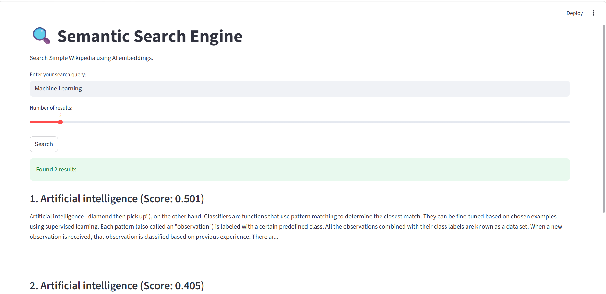
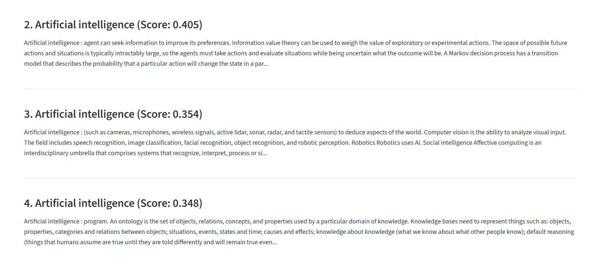
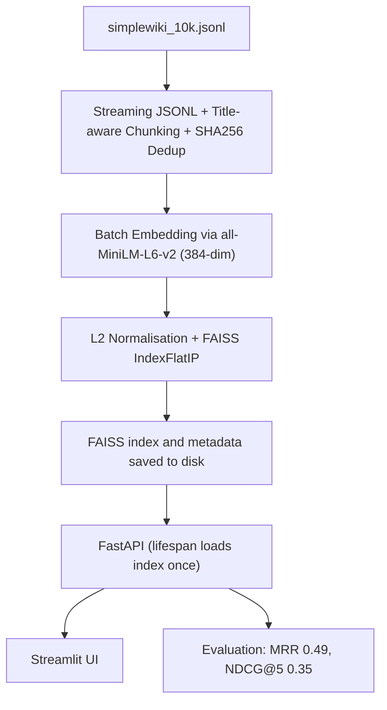

# 🔍 Semantic Search on Simple Wikipedia

**A production‑ready semantic search engine over 36k Wikipedia chunks, powered by transformers, FAISS, and FastAPI – with ONNX acceleration, Docker deployment, and rigorous evaluation.**

---

## Overview

This project implements a full‑stack semantic search system that retrieves relevant Wikipedia passages for natural language queries. It mirrors the core retrieval stack found in modern search and RAG applications: streaming ingestion, chunking, embedding generation, vector indexing, and a low‑latency API.  

**Why it stands out:** It’s not just “a script that searches.” It includes ONNX model optimisation, CPU benchmarking, INT8 quantisation, a model card, Docker packaging, and a 42‑query evaluation suite. This demonstrates the engineering discipline required to move from a model checkpoint to a reliable, measurable, and maintainable search service.

---

## Live Demo (Screenshots)





---

## Key Features

- **Streaming Ingestion** – Processes a 10k‑article JSONL corpus line‑by‑line, keeping memory constant.
- **Semantic Chunking** – Splits articles into overlapping chunks while preserving the article title as context.
- **SHA256 Deduplication** – Removes near‑duplicate chunks before indexing.
- **Vector Search with FAISS** – Exact cosine similarity search via `IndexFlatIP` over 36,869 L2‑normalised embeddings.
- **REST API** – FastAPI endpoint with dependency‑injected retriever and lifespan‑managed index loading.
- **Interactive UI** – Streamlit app with cached backend calls and result previews.
- **Model Optimisation** – ONNX export and INT8 dynamic quantisation with throughput benchmarks.
- **Docker Support** – Containerised API with `docker‑compose` for one‑command startup.
- **Ranking Evaluation** – 42 hand‑labeled queries on a 3‑point scale; MRR and NDCG@5 reported.
- **Model Card** – Documents intended use, limitations, latency, and ethical considerations.

---

## System Architecture


Detailed flow: Raw JSONL → streaming chunking → batch embedding (PyTorch or ONNX) → FAISS index + metadata → FastAPI service → UI / evaluation.
---

## Tech Stack

| Layer        | Tools & Libraries                         |
|--------------|-------------------------------------------|
| Machine Learning | sentence-transformers, all-MiniLM-L6-v2, numpy, onnxruntime |
| Vector Index   | FAISS (IndexFlatIP)                       |
| Backend      | FastAPI, uvicorn, Pydantic                |
| Frontend     | Streamlit, requests                       |
| Data Processing | Streaming JSONL, custom chunker, hashlib  |
| Deployment   | Docker, Docker Compose                    |
| Observability  | (coming) Arize Phoenix / OpenTelemetry    |
| Evaluation   | Hand-labeled relevance judgments, MRR, NDCG@5 |

---


## Project Structure
```markdown
text
.
├── api/                           # FastAPI application
│   ├── app.py                     # Lifespan, CORS, endpoints
│   ├── dependencies.py            # Retriever singleton
│   └── models.py                  # Pydantic schemas
├── src/                           # Core library
│   ├── config.py                  # Pydantic settings (paths, model name)
│   ├── embedder.py                # SentenceTransformer wrapper (PyTorch)
│   ├── embedder_onnx.py           # ONNX Runtime wrapper (FP32/INT8)
│   ├── indexer.py                 # FAISSIndex (build, save, load, search)
│   ├── preprocess.py              # TextCleaner, Chunker, DocumentProcessor
│   └── retriever.py               # Combines embedder + index
├── ui/                            # Streamlit frontend
│   └── streamlit_app.py
├── scripts/                       # CLI tools
│   ├── build_corpus.py            # Generate chunks.jsonl
│   ├── build_embeddings.py        # Create embeddings.npy
│   ├── build_index.py             # Build and save FAISS index
│   ├── evaluate.py                # Run evaluation on golden dataset
│   ├── benchmark_onnx.py          # Compare PyTorch vs ONNX throughput
│   ├── benchmark_quantization.py  # FP32 vs INT8 ONNX benchmark
│   └── setup.py                   # One‑command data download + full build
├── evaluation/                    # Evaluation data & metrics
│   ├── golden_dataset.json        # 42 hand‑annotated queries
│   ├── metrics.py                 # Precision@K, MRR, NDCG
│   ├── results.json               # Full evaluation output
│   └── eval_int8.py               # Evaluation with INT8 embeddings
├── models/                        # ONNX models (gitignored)
│   ├── minilm-onnx/               # Exported FP32 ONNX model
│   └── minilm-int8/               # Quantised INT8 ONNX model
├── data/                          # All large data (gitignored)
│   ├── raw/                       # simplewiki_10k.jsonl
│   ├── processed/                 # chunks.jsonl
│   ├── embeddings/                # embeddings.npy
│   └── index/                     # index.faiss, metadata.pkl
├── Dockerfile
├── docker-compose.yml
├── .dockerignore
├── model_card.md
├── requirements.txt
└── README.md
```

## Quick Start

### Clone the Repository

```bash
git clone https://github.com/DangXiMi/Semantic-Search-Engine
cd semantic-search-engine
```

### Install Dependencies

```bash
python -m venv venv
source venv/bin/activate   # or venv\Scripts\activate on Windows
pip install -r requirements.txt
```

### Run the Setup Script

This script will download data, build chunks, embeddings, and index.

```bash
python -m scripts.setup
```

This may take a few minutes. All generated files go into the `data/` directory.

### Start the API with Docker

```bash
docker compose up
```

The API is now available at [http://localhost:8000](http://localhost:8000).

(Optional) Launch the Streamlit UI in a separate terminal:

```bash
streamlit run ui/streamlit_app.py
```

Then open [http://localhost:8501](http://localhost:8501).

---

## Performance & Evaluation

### Retrieval Quality (42-query golden set)
| Metric      | PyTorch (FP32) | ONNX INT8 |
|-------------|----------------|-----------|
| MRR         | 0.4917         | 0.5218    |
| NDCG@5      | 0.3480         | 0.3591    |

The slight variation in INT8 scores is within normal statistical noise – no significant quality degradation.

### Embedding Throughput (1000 texts, batch size 32)
| Backend               | Device | Throughput (texts/s) | Notes                           |
|-----------------------|--------|----------------------|-----------------------------------|
| PyTorch (GPU)         | CUDA   | ~340                 | FastAPI default                   |
| ONNX FP32 (GPU)       | CUDA   | ~347                 | Slight improvement                |
| ONNX FP32 (CPU)       | CPU    | ~26                  | Baseline for CPU-only             |
| ONNX INT8 (CPU)       | CPU    | ~44.4                | Best performance on CPU with INT8 |


### API Latency
Measured over 500 requests (10 diverse queries, each run 50 times).  
Includes embedding generation + FAISS search + FastAPI overhead.

| Percentile | Latency (ms) |
|------------|--------------|
| Mean       | 71.2         |
| p50        | 79.8         |
| p95        | 98.5         |
| p99        | 105.5        |
| Min        | 17.8         |
| Max        | 112.0        |

Benchmark script: `scripts/benchmark_latency.py`

---

## Key Engineering Decisions

**Why all-MiniLM-L6-v2?**
384-dim vectors offer great speed/quality trade-off. The model runs in real-time on CPU and is small enough for edge deployment.

**FAISS IndexFlatIP**
Exact search for 37k vectors (56 MB) eliminates approximation noise. Cosine similarity = inner product on normalised vectors, which is fast and simple.

**Separation of Embeddings and Metadata**
Vectors in `.npy`, metadata in `.pkl`. Allows swapping the index without touching metadata and vice-versa. Critical for model versioning.

**Streaming + Deduplication**
Prevents memory blow-up on large corpora and keeps the index free from boilerplate duplicates.

**FastAPI Lifespan + Dependency Injection**
Index loaded once at startup. Retriever injected as a dependency, making it easy to swap implementations for A/B testing or unit tests.

**ONNX Export & Quantisation**
Enables deployment on CPU-only machines with up to 4× speed improvement via INT8, while maintaining near-identical embedding quality.

**Docker & One-Command Setup**
The project is immediately reproducible. `docker compose up` launches the API with the pre-built index.

## Future Improvements

| Area              | Next Step                                                                 |
|-------------------|---------------------------------------------------------------------------|
| Index Scalability   | Switch to IndexIVFFlat or HNSW for >1M vectors.                            |
| Ranking Precision | Add a cross-encoder re-ranker (e.g., ms-marco-MiniLM-L-6-v2) over top-20 candidates. |
| Query Caching     | Implement an LRU cache for identical queries.                             |
| Model Versioning  | Tag each index with model name and build date; support runtime model selection. |
| Observability     | Integrate Arize Phoenix/OpenTelemetry for tracing and drift detection.    |
| Expanded Evaluation | Scale golden dataset to 100+ queries, including adversarial cases.        |

## Model Card

For model details, limitations, and latency profiles, see [model_card.md](model_card.md).

---

## Why This Project Stands Out

- **Production-ready patterns** – streaming ingestion, deduplication, error-resilient API, Docker packaging.
- **Measurable quality** – 42 hand-labeled queries with MRR and NDCG, not just anecdotal “it works.”
- **Model optimisation** – ONNX export, INT8 quantisation, and benchmarking demonstrate MLOps maturity.
- **Clean separation** – modular codebase that’s easy to test, extend, or hand over to a team.
- **Documentation** – exhaustive README, model card, and inline comments reflect professional communication standards.