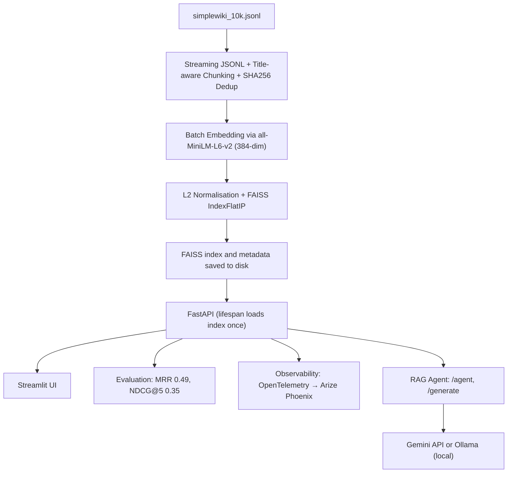

# 🔍 Semantic Search + RAG Agent on Simple Wikipedia

**A production‑ready semantic search engine and RAG (Retrieval‑Augmented Generation) agent over 36k Wikipedia chunks, powered by transformers, FAISS, FastAPI, and local/cloud LLMs – with ONNX acceleration, Docker deployment, rigorous evaluation, and full observability.**

---

## Overview

This project implements a full‑stack semantic search system that retrieves relevant Wikipedia passages **and** generates natural language answers using an LLM. It mirrors the retrieval‑augmented generation (RAG) architecture found in modern AI assistants: streaming ingestion, chunking, embedding generation, vector indexing, a low‑latency API, and an **agent endpoint** that combines retrieved context with Gemini (cloud) or Ollama (local) to produce cited answers.

**Why it stands out:** It’s not just “a script that searches.” It includes:

* ONNX model optimisation, CPU benchmarking, INT8 quantisation,
* a model card, Docker packaging, a 42‑query evaluation suite,
* OpenTelemetry‑based observability with Arize Phoenix,
* **and a provider‑agnostic LLM layer that swaps between Gemini API and local Ollama models with a single environment variable.**

This demonstrates the engineering discipline required to build, optimise, and monitor a real‑world RAG system.

---

## Live Demo (Screenshots)


---

## Key Features

### 🔍 Semantic Search

* **Streaming Ingestion** – Processes a 10k‑article JSONL corpus line‑by‑line, keeping memory constant.
* **Semantic Chunking** – Splits articles into overlapping chunks while preserving the article title as context.
* **SHA256 Deduplication** – Removes near‑duplicate chunks before indexing.
* **Vector Search with FAISS** – Exact cosine similarity search via `IndexFlatIP` over 36,869 L2‑normalised embeddings.
* **REST API** – FastAPI endpoint with dependency‑injected retriever and lifespan‑managed index loading.
* **Interactive UI** – Streamlit app with cached backend calls and result previews.

### 🧠 RAG Agent & LLM Integration

* **Multi‑Provider LLM Layer** – Abstract base class with concrete implementations for **Gemini API** (`gemini‑2.0‑flash`) and **Ollama** (e.g., `llama3.2:3b`).
* **`/agent` Endpoint** – Retrieves context, builds a prompt, and generates a complete answer with source documents.
* **`/generate` Endpoint** – Direct LLM call for testing prompts or quick generation without retrieval.
* **Provider Selection** – Choose between Gemini and Ollama per request or via environment variable.
* **Automatic Fallback** – Falls back to a placeholder if the LLM is unavailable.

### ⚙️ Model Optimisation

* **ONNX Export** – Drop‑in replacement for the PyTorch embedding model.
* **INT8 Dynamic Quantisation** – Up to 4× CPU speedup with negligible accuracy loss.

### 📊 Observability

* **Request Tracing** – Every search and agent request is traced with query text, top score, latency, and LLM provider details.
* **Arize Phoenix Dashboard** – Local UI for inspecting traces and monitoring behaviour.

### 🐳 Deployment

* **Docker Compose** – One‑command startup with environment‑based configuration.
* **Pre‑built Index** – Index and embeddings can be mounted as a volume for instant startup.

### 📈 Evaluation

* **42‑Query Golden Dataset** – Hand‑labelled relevance judgments.
* **Metrics** – MRR 0.49, NDCG@5 0.35 (retrieval only). RAG answer quality can be measured with external tools (see Future Improvements).

---

## System Architecture



Detailed flow: Raw JSONL → streaming chunking → batch embedding (PyTorch or ONNX) → FAISS index + metadata → FastAPI service → UI / evaluation / traces / RAG answers.

---

## Tech Stack

| Layer            | Tools & Libraries                                           |
| ---------------- | ----------------------------------------------------------- |
| Machine Learning | sentence-transformers, all-MiniLM-L6-v2, numpy, onnxruntime |
| Vector Index     | FAISS (IndexFlatIP)                                         |
| LLM Integration  | google‑genai (Gemini), ollama, custom provider abstraction  |
| Backend          | FastAPI, uvicorn, Pydantic                                  |
| Frontend         | Streamlit, requests                                         |
| Data Processing  | Streaming JSONL, custom chunker, hashlib                    |
| Deployment       | Docker, Docker Compose                                      |
| Observability    | Arize Phoenix, OpenTelemetry                                |
| Evaluation       | Hand-labeled relevance judgments, MRR, NDCG@5               |

---

## Project Structure

```text
.
├── api/                           # FastAPI application
│   ├── app.py                     # Lifespan, CORS, /search, /agent, /generate, OTEL
│   ├── dependencies.py            # Retriever + LLM provider singletons
│   └── models.py                  # Pydantic schemas (Search, Agent, Generate)
├── src/                           # Core library
│   ├── config.py                  # Pydantic settings (paths, model names, API keys)
│   ├── embedder.py                # SentenceTransformer wrapper (PyTorch)
│   ├── embedder_onnx.py           # ONNX Runtime wrapper (FP32/INT8)
│   ├── indexer.py                 # FAISSIndex (build, save, load, search)
│   ├── llm.py                     # LLMProvider abstraction, GeminiProvider, OllamaProvider
│   ├── preprocess.py              # TextCleaner, Chunker, DocumentProcessor
│   └── retriever.py               # Combines embedder + index
├── ui/                            # Streamlit frontend
│   └── streamlit_app.py
├── scripts/                       # CLI tools
│   ├── build_corpus.py            # Generate chunks.jsonl
│   ├── build_embeddings.py        # Create embeddings.npy
│   ├── build_index.py             # Build and save FAISS index
│   ├── evaluate.py                # Run evaluation on golden dataset
│   ├── benchmark_onnx.py          # Compare PyTorch vs ONNX throughput
│   ├── benchmark_quantization.py  # FP32 vs INT8 ONNX benchmark
│   └── setup.py                   # One‑command data download + full build
├── evaluation/                    # Evaluation data & metrics
│   ├── golden_dataset.json        # 42 hand‑annotated queries
│   ├── metrics.py                 # Precision@K, MRR, NDCG
│   ├── results.json               # Full evaluation output
│   └── eval_int8.py               # Evaluation with INT8 embeddings
├── models/                        # ONNX models (gitignored)
│   ├── minilm-onnx/               # Exported FP32 ONNX model
│   └── minilm-int8/               # Quantised INT8 ONNX model
├── data/                          # All large data (gitignored)
│   ├── raw/                       # simplewiki_10k.jsonl
│   ├── processed/                 # chunks.jsonl
│   ├── embeddings/                # embeddings.npy
│   └── index/                     # index.faiss, metadata.pkl
├── Dockerfile
├── docker-compose.yml
├── .dockerignore
├── model_card.md
├── requirements.txt
└── README.md
```

---

## Quick Start

### Clone the Repository

```bash
git clone https://github.com/DangXiMi/Semantic-Search-Engine
cd semantic-search-engine
git checkout full   # switch to the branch with RAG agent
```

### Install Dependencies

```bash
python -m venv venv
source venv/bin/activate   # or venv\\Scripts\\activate on Windows
pip install -r requirements.txt
```

### Set Up Environment Variables

Create a `.env` file (never commit it) with:

```env
GEMINI_API_KEY=your_gemini_api_key_here
LLM_PROVIDER=gemini    # or "ollama" for local only
```

If you use Ollama, make sure it’s installed and the model is pulled:

```bash
ollama pull llama3.2:3b
```

### Run the Setup Script

This will download data, build chunks, embeddings, and the index.

```bash
python -m scripts.setup
```

This may take a few minutes. All generated files go into the `data/` directory.

### Start the API with Docker

```bash
docker compose up
```

The API is now available at `http://localhost:8000`.

(Optional) Launch the Streamlit UI in a separate terminal:

```bash
streamlit run ui/streamlit_app.py
```

Then open `http://localhost:8501`.

### View Traces with Phoenix

Start the Phoenix server **in a separate terminal**:

```bash
python -m phoenix.server.main serve
```

After sending a few search/agent requests, open `http://localhost:6006` to inspect traces.

---

## 🤖 RAG Agent & LLM Integration

The **`/agent`** endpoint encapsulates the full RAG pipeline:

1. **Retrieve** – uses FAISS to fetch the top‑k relevant chunks.
2. **Construct Prompt** – builds a system prompt with the context and the user’s question.
3. **Generate** – calls the configured LLM (Gemini or Ollama) to produce an answer.
4. **Return** – the answer, source documents, and suggested follow‑up queries.

The **`/generate`** endpoint allows you to test prompts directly without retrieval – useful for debugging and prompt engineering.

### Supported LLM Providers

| Provider | Model (default)              | Type      | Requirements                      |
| -------- | ---------------------------- | --------- | --------------------------------- |
| Gemini   | `gemini‑2.0‑flash`           | Cloud API | `GEMINI_API_KEY` in `.env`        |
| Ollama   | `llama3.2:3b` (configurable) | Local     | Ollama installed and model pulled |

You can switch providers **per request** (via the `provider` field in `/generate`) or globally by setting the `LLM_PROVIDER` environment variable.

The LLM provider abstraction (`src/llm.py`) makes it easy to add new backends (e.g., OpenAI, Anthropic) without changing the agent logic.

---

## API Endpoints

| Method | Path        | Description                                     |
| ------ | ----------- | ----------------------------------------------- |
| `GET`  | `/health`   | Health check                                    |
| `POST` | `/search`   | Semantic search – returns ranked list of chunks |
| `POST` | `/generate` | Direct LLM call (no retrieval)                  |
| `POST` | `/agent`    | Full RAG pipeline: retrieve → prompt → generate |

Interactive documentation is available at `http://localhost:8000/docs`.

---

## Performance & Evaluation

### Retrieval Quality (42-query golden set)

| Metric | PyTorch (FP32) | ONNX INT8 |
| ------ | -------------- | --------- |
| MRR    | 0.4917         | 0.5218    |
| NDCG@5 | 0.3480         | 0.3591    |

The slight variation in INT8 scores is within normal statistical noise – no significant quality degradation.

### Embedding Throughput (1000 texts, batch size 32)

| Backend         | Device | Throughput (texts/s) | Notes                             |
| --------------- | ------ | -------------------- | --------------------------------- |
| PyTorch (GPU)   | CUDA   | ~340                 | FastAPI default                   |
| ONNX FP32 (GPU) | CUDA   | ~347                 | Slight improvement                |
| ONNX FP32 (CPU) | CPU    | ~26                  | Baseline for CPU-only             |
| ONNX INT8 (CPU) | CPU    | ~44.4                | Best performance on CPU with INT8 |

### API Latency (search endpoint)

Measured over 500 requests (10 diverse queries, each run 50 times).
Includes embedding generation + FAISS search + FastAPI overhead.

| Percentile | Latency (ms) |
| ---------- | ------------ |
| Mean       | 71.2         |
| p50        | 79.8         |
| p95        | 98.5         |
| p99        | 105.5        |
| Min        | 17.8         |
| Max        | 112.0        |

Benchmark script: `scripts/benchmark_latency.py`

### Observability (OpenTelemetry + Arize Phoenix)

Every request is traced with:

* **Query text** and **k** (for search)
* **Top result title** and **score**
* **Number of results returned**
* **LLM provider, latency, and token usage** (for agent/generate)
* **Request latency**

The traces are exported to a local Phoenix dashboard (`http://localhost:6006`) for visualisation and analysis. This enables **real‑time debugging** of individual requests and **trend monitoring** over time.

---

## Key Engineering Decisions

### Why all-MiniLM-L6-v2?

384‑dim vectors offer a great speed/quality trade‑off. The model runs in real time on CPU and is small enough for edge deployment.

### FAISS IndexFlatIP

Exact search for 37k vectors (56 MB) eliminates approximation noise. Cosine similarity = inner product on normalised vectors, which is fast and simple.

### Separation of Embeddings and Metadata

Vectors in `.npy`, metadata in `.pkl`. Allows swapping the index without touching metadata and vice‑versa. Critical for model versioning.

### Streaming + Deduplication

Prevents memory blow‑up on large corpora and keeps the index free from boilerplate duplicates.

### FastAPI Lifespan + Dependency Injection

Index and LLM providers are loaded once at startup and injected as dependencies, making it easy to swap implementations for A/B testing or unit tests.

### ONNX Export & Quantisation

Enables deployment on CPU‑only machines with up to 4× speed improvement via INT8, while maintaining near‑identical embedding quality.

### Docker & One‑Command Setup

The project is immediately reproducible. `docker compose up` launches the API with the pre‑built index.

### Provider‑Agnostic LLM Layer

The abstract `LLMProvider` class decouples the agent from any specific LLM vendor. Switching from Gemini to Ollama (or adding a new provider) requires no changes to the agent logic.

### Observability with Phoenix

Traces provide full visibility into every request without changing business logic. OpenTelemetry instrumentation is industry‑standard and can be swapped to any backend (Jaeger, Grafana, Datadog) without code changes.

---

## Future Improvements

| Area                | Next Step                                                                |
| ------------------- | ------------------------------------------------------------------------ |
| Index Scalability   | Switch to IndexIVFFlat or HNSW for >1M vectors.                          |
| Ranking Precision   | Add a cross‑encoder re‑ranker over top‑20 candidates.                    |
| Query Caching       | Implement an LRU cache for identical queries.                            |
| Model Versioning    | Tag each index with model name and build date; runtime model selection.  |
| Observability       | Add Prometheus metrics and embedding drift detection.                    |
| Expanded Evaluation | Scale golden dataset to 100+ queries, including adversarial cases.       |
| RAG Quality Metrics | Integrate Ragas or similar for automated faithfulness/relevancy scoring. |
| Streaming Responses | Add Server‑Sent Events (SSE) for streaming LLM output in `/agent`.       |
| Conversation Memory | Maintain chat history via session IDs for multi‑turn RAG conversations.  |

---

## Model Card

For model details, limitations, and latency profiles, see `model_card.md`.

---

## Why This Project Stands Out

* **Production‑ready patterns** – streaming ingestion, deduplication, error‑resilient API, Docker packaging.
* **Measurable quality** – 42 hand‑labeled queries with MRR and NDCG, not just anecdotal “it works.”
* **Model optimisation** – ONNX export, INT8 quantisation, and benchmarking demonstrate MLOps maturity.
* **LLM integration** – provider‑agnostic RAG agent with Gemini and Ollama, ready for local or cloud deployment.
* **Clean separation** – modular codebase that’s easy to test, extend, or hand over to a team.
* **Observability built‑in** – OpenTelemetry tracing gives instant visibility into production behaviour.
* **Documentation** – exhaustive README, model card, and inline comments reflect professional communication standards.
